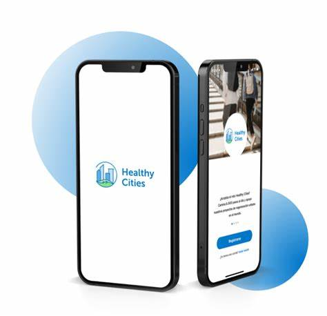

# PEC3_Manovich_Reloaded
> Grado Multimedia | 20.644 - Cultura Digital - Aula 1 | PEC3 | **Autor: Ismael Martínez Linde**

# Introducción
<table>
  <tr>
    <td style="width: 70%; padding-right: 20px;">
    Según <b>Lev Manovich</b>, la hibridación digital implica la combinación de diferentes medios y formas para crear nuevas prácticas culturales. En este ensayo, expongo dos ejemplos de hibridación: la app Healthy Cities creada por la aseguradora Sanitas y la plataforma de comercio electrónico Shopify. Ambas       iniciativas combinan elementos digitales y tradicionales con el fin de ofrecer soluciones innovadoras y eficaces.  
       En la era digital, la hibridación se ha convertido en un fenómeno crucial que integra tecnología avanzada con prácticas tradicionales para mejorar diversos aspectos de la vida. 
    </td>
    <td style="width: 30%;">
      
    </td>
  </tr>
</table>
  

# App Healthy Cities

 Healthy Cities es una aplicación móvil diseñada para promover hábitos de vida saludables entre los ciudadanos. Lanzada en 2015, esta aplicación tiene como objetivo principal fomentar la actividad física y la participación en retos saludables entre sus usuarios. Utilizando una interfaz intuitiva, la app permite a los usuarios registrar su actividad física diaria, participar en desafíos comunitarios y seguir su progreso en tiempo real.
            

Sanitas, una aseguradora de salud reconocida en España, ha utilizado esta plataforma no solo como una herramienta de promoción de la salud, sino también como una forma de involucrar a la comunidad en actividades colectivas que benefician su bienestar general. La aplicación está disponible para dispositivos iOS y Android y se puede descargar de manera gratuita. 
          

### Hibridación según Manovich

Desde la perspectiva de <b>Manovich</b>, Healthy Cities representa un claro ejemplo de hibridación al combinar múltiples formas de medios y prácticas. <b>Manovich</b> define la hibridación como el proceso mediante el cual se integran diferentes tecnologías y formas culturales para crear nuevos medios. En este contexto, la app de Sanitas hibrida varias tecnologías digitales, como el seguimiento de actividad mediante sensores de dispositivos móviles, la gamificación a través de retos y recompensas, y la conectividad social al permitir a los usuarios compartir sus logros en redes sociales.   

> "La hibridación de medios crea nuevas realidades culturales al combinar elementos previamente separados" (Manovich, 2013).

En el caso de la App Healthy Cities, la combinación de tecnologías móviles y gamificación crea una nueva forma de involucrar a las personas en actividades saludables.

> "La interacción y la participación son componentes clave de las experiencias híbridas" (Manovich, 2013).

Esto se refleja en cómo la app incentiva la participación activa de los usuarios a través de desafíos y recompensas.
  

### Resultados y Efectos
Desde su lanzamiento, Healthy Cities ha logrado un impacto significativo en la promoción de hábitos saludables. Según datos de Sanitas, los usuarios de la app han registrado millones de pasos y han participado en cientos de desafíos colectivos, convirtiéndose en una reconocida iniciativa por su efectividad en la mejora de la salud pública, demostrando cómo la integración de tecnología y prácticas tradicionales de salud puede generar resultados tangibles. 
   
Además, la app ha fomentado una mayor conciencia sobre la importancia de la actividad física y ha creado una comunidad comprometida con el bienestar. Los testimonios de los usuarios y las estadísticas de uso reflejan un incremento en la motivación y la participación en actividades saludables, subrayando el éxito de la hibridación digital en este contexto.
    

***

 

# Shopify

Shopify es una plataforma de comercio electrónico fundada en 2006 que permite a emprendedores y negocios de todos los tamaños crear y gestionar sus propias tiendas en línea de manera fácil y eficiente. Con más de un millón de negocios en más de 175 países, Shopify ha transformado la manera en que se lleva a cabo el comercio minorista, proporcionando una infraestructura completa que incluye diseño de la tienda, gestión de productos, pagos, envíos y análisis de datos.    

La plataforma ofrece una amplia gama de herramientas y aplicaciones integradas que facilitan la personalización y la optimización de las tiendas en línea. Además, Shopify ha desarrollado un ecosistema robusto que incluye desarrolladores, diseñadores y expertos en marketing que contribuyen a mejorar continuamente la experiencia del usuario. 

### Hibridación según Manovich

 Desde la perspectiva de <b>Manovich</b>, Shopify ejemplifica la hibridación digital al combinar el comercio tradicional con las tecnologías digitales avanzadas. Shopify logra esto al integrar elementos del comercio minorista clásico, como la venta de productos físicos, con herramientas digitales que automatizan y optimizan el proceso de venta.    

> "La verdadera innovación en la era digital proviene de la combinación de diferentes tecnologías y medios" (Manovich, 2013).

Shopify aplica este principio al integrar herramientas de gestión de productos, pagos y análisis de datos en una sola plataforma.

> "La personalización y la adaptabilidad son fundamentales en los medios híbridos" (Manovich, 2013).

Esto es evidente en cómo Shopify permite a los comerciantes personalizar la experiencia de compra y adaptarse a las necesidades de sus clientes a través de datos analíticos y marketing digital.

Un aspecto clave de la hibridación en Shopify es la personalización. Los comerciantes pueden utilizar datos analíticos y herramientas de marketing digital para personalizar la experiencia de compra para cada cliente. Esta capacidad de personalización se ve potenciada por la inteligencia artificial y el aprendizaje automático, que permiten a Shopify ofrecer recomendaciones de productos y estrategias de marketing adaptadas a las necesidades individuales de cada negocio.
  

### Resultados y Efectos
Shopify ha tenido un impacto transformador en el comercio electrónico, democratizando el acceso a herramientas avanzadas que antes solo estaban disponibles para grandes corporaciones. La plataforma ha permitido a pequeñas y medianas empresas competir en igualdad de condiciones con gigantes del comercio minorista, fomentando la innovación y la diversidad en el mercado.
   
Además, Shopify ha sido un motor clave en la creación de empleos y el apoyo a economías locales, al permitir a los emprendedores lanzar y escalar sus negocios de manera eficiente.

La hibridación en Shopify no solo ha mejorado la experiencia del consumidor, sino que también ha redefinido el panorama del comercio, subrayando la importancia de la integración tecnológica en el éxito empresarial contemporáneo.
  

# Conclusión
La hibridación es esencial en el mundo actual, ya que permite la creación de soluciones innovadoras que mejoran la vida de las personas y optimizan los negocios tanto desde el punto de vista de consumidor como del comerciante. Los ejemplos de la App Healthy Cities y Shopify ilustran cómo la combinación de tecnología y prácticas tradicionales puede generar resultados positivos, sostenibles y tangibles. Utilizando el marco de hibridación digital de <b>Manovich</b>, podemos entender mejor cómo estas iniciativas integran diversas tecnologías y formas culturales para crear nuevas prácticas y experiencias significativas.

Ambos casos demuestran cómo ha sido posible transformar sectores tradicionales mediante la incorporación de tecnologías digitales. Siendo el caso de Healthy Cities un enfoque en salud y bienestar, incentivando la actividad física y creando una comunidad comprometida. Mientras, Shopify se centra en el comercio y los negocios, facilitando la creación y gestión de tiendas en línea y promoviendo la personalización y la omnicanalidad.
  

## Bibliografía y webgrafía

Animated GIF Maker. (s. f.). Ezgif.com. Recuperado 20 de mayo de 2024, de https://ezgif.com/maker

Bio, S. F. (2024, abril 4). What is Shopify and how to use it in eCommerce. Egnition. https://egnition.io/a/articles/what-is-shopify-and-how-to-use-it

Español, S. en. (s. f.). El efecto Shopify: cómo los emprendedores están cambiando el mundo. Shopify. Recuperado 20 de mayo de 2024, de https://www.shopify.com/es/blog/efecto-shopify

Github.com Documentación de la Ayuda. (s. f.). Recuperado 20 de mayo de 2024, de https://docs.github.com/es

Icono de Evaluación Generic color lineal-color. (s. f.). Freepik. Recuperado 20 de mayo de 2024, de https://www.freepik.es/icono/evaluacion_12176858

Icono de Gafas Generic Others. (s. f.). Freepik. Recuperado 20 de mayo de 2024, de https://www.freepik.es/icono/gafas_5127533

Lev manovich. (s. f.). Manovich.net. Recuperado 20 de mayo de 2024, de http://manovich.net/index.php/about

Manovich, L. (2014). El software toma el mando. Editorial Uoc.

Sostenibilidad. (2023, marzo 31). Sanitas. https://corporativo.sanitas.es/sostenibilidad

Stack Overflow - where developers learn, share, & build careers. (s. f.). Stack Overflow. Recuperado 20 de mayo de 2024, de https://stackoverflow.com/
